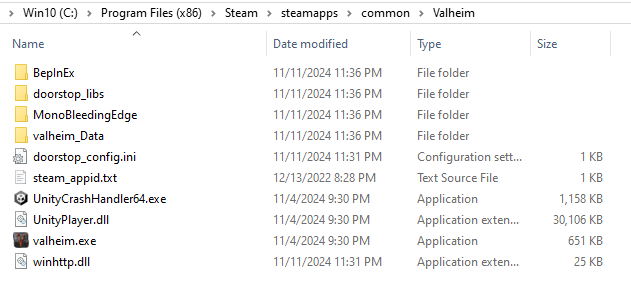

# GBB.Valheim.ModPack
This serves as a host for the GBB Valheim modpack, this is required to be installed before joining the GBB Valheim dedicated server.

# Installation
1. Download the most recent zip file found in the releases section.
    * https://github.com/12emerta/GBB.Valheim.ModPack/releases
2. Extract the zip file and all its contents.
3. Place the extracted files into the base Valheim game directory
    * i.e. `C:\Program Files (x86)\Steam\steamapps\common\Valheim`
    * Your base game dir should now have a BepInEx folder located in it (i.e. `C:\Program Files (x86)\Steam\steamapps\common\Valheim\BepInEx`)
    * If you already have a BepInEx folder in the game directory it is best to fully delete it and replace it with this directory.
        * If you have custom configurations, do not delete the whole directory, it might be okay to just override all files (assuming you don't have extra mods and we haven't removed any).

# Mods
These are the following mods used within this mod pack:
* [Azu Auto Store](https://thunderstore.io/c/valheim/p/Azumatt/AzuAutoStore/)
    * Allows players to quick stack items from inventory into containers.
* [Azu Crafty Boxes](https://thunderstore.io/c/valheim/p/Azumatt/AzuCraftyBoxes/)
    * Allows players to access and use resources from nearby containers when crafting and building
* [Better Archery](https://thunderstore.io/c/valheim/p/ishid4/BetterArchery/)
    * QoL upgrades to archery including zoom, quiver, & retrievable arrows
* [Crop Utils](https://thunderstore.io/c/valheim/p/NoPetRides/CropUtils/)
    * Better & easier crop planting & picking.
* [Equipment And Quick Slots](https://thunderstore.io/c/valheim/p/RandyKnapp/EquipmentAndQuickSlots/)
    * Give equipped items their own dedicated inventory slots, plus three more hotkey-able quick slots.
* Groups (Valheim+)
    * Allows Groups - used for Whacky Epic MMO XP sharing.
* [Plant Everything](https://thunderstore.io/c/valheim/p/Advize/PlantEverything/)
    * Allows your cultivator to plant berry bushes, thistle, dandelions, mushrooms, previously unavailable tree types, and other decorative flora.
* [Resin Guard](https://thunderstore.io/c/valheim/p/Azumatt/ResinGuard/)
    * Allows you to apply resin and tar to your building pieces giving them better resistance to the elements.
* [Valheim Armory](https://thunderstore.io/c/valheim/p/MidnightMods/ValheimArmory/)
    * Allows crafting of all weapon types at different levels of the games by adding new weapon levels.
* [Valheim Plus (Grantapher)](https://thunderstore.io/c/valheim/p/Grantapher/ValheimPlus_Grantapher_Temporary/)
    * Allows for complete overhaul & customization of every aspect of Valheim.
    * See [configuration diff](https://github.com/12emerta/GBB.Valheim.ModPack/commit/ba0871bff6646115880de84dd24cbbcb065d7689) for overview of our changes.
* [Whacky Epic MMO](https://thunderstore.io/c/valheim/p/WackyMole/WackyEpicMMOSystem/)
    * Adds an MMO-like system to Valheim, with levels, groups, skills, etc.
    * UI is user-customizable, config will show up after launching game with mod installed. Can also drag around in game.
        * See config file - `C:\Program Files (x86)\Steam\steamapps\common\Valheim\BepInEx\config\WackyMole.EpicMMOSystemUI.cfg`
